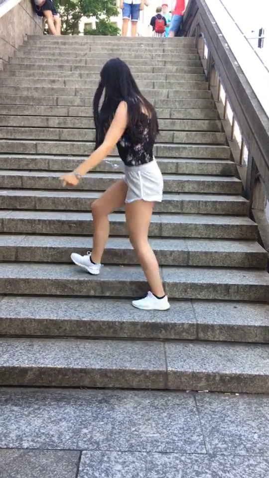

## TikTok segmentation Documentation

### Overview
This documentation provides information about the TikTok segmentation project, including the data used, the methods and ideas employed, and the accuracy achieved. It also includes usage instructions and author information.


### Data
The dataset used for training and scoring is loaded with pytorch and consists images with dancing people.

Link on dataset: https://www.kaggle.com/datasets/tapakah68/segmentation-full-body-tiktok-dancing-dataset

## Model Architecture
The TikTok segmentation neural network model is built using the Unet architecture. The architecture of the model consists two parts -- encoder and decoder.

## Training
The model is trained on the provided dataset using the following configuration:
- Optimizer: Adam
- Learning rate: 0.001
- Loss function: BCEWithLogitsLoss
- Batch size: 8
- Number of epochs: 10

## IOU
After training, the model achieved an IOU of 90% on the validation set.

## Usage
To use the trained model for TikTok segmentation, follow the instructions below:

Build docker image using command:
 ```bash
docker-compose -f docker_compose_file_path up
```
### Example:
```bash
docker-compose -f D:\Project\TikTok\docker-compose.yml up
```
### Example input/output:
    



## Author
This TikTok segmentation project was developed by Namchuk Maksym. If you have any questions, please contact with me: namchuk.maksym@gmail.com
