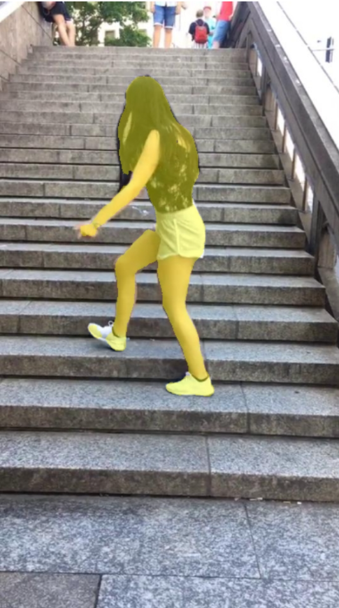

## TikTok segmentation 

### Overview
This documentation provides information about the TikTok segmentation project, including the data used, the methods and ideas employed, and the accuracy achieved. It also includes usage instructions and author information.

### Example for image:
    




### Example for video:


### Data
The dataset used for training and scoring is loaded with pytorch and consists images with dancing people.

[Link to the dataset on Kaggle](https://www.kaggle.com/datasets/tapakah68/segmentation-full-body-tiktok-dancing-dataset
)
## Model Architecture
The TikTok segmentation neural network model is built using the Unet architecture. The architecture of the model consists two parts -- encoder and decoder.
## IOU
After training, the model achieved an IOU of 90% on the validation set.
## Usage
### Requirements

- Python 3.10

### Getting Started
Clone repository
```bash
git clone https://github.com/SoulHb/TikTok.git
```
Move to project folder
```bash
cd TikTok
```
Install dependencies
```bash
pip install -r requirements.txt
```
### Training
The model is trained on the provided dataset using the following configuration:
- Optimizer: Adam
- Learning rate: 0.001
- Loss function: BCEWithLogitsLoss
- Batch size: 8
- Number of epochs: 10

Run train.py
```bash
python train.py --saved_model_path your_model_path --epochs 10 --lr 0.001 --batch_size 32 /path/to/Examples /path/to/masks
```

## Inference
To use the trained model for TikTok segmentation, follow the instructions below:

### Without docker:
Move to src folder
```bash
cd src
```
Run Flask api
```bash
python inference.py --saved_model_path /path/to/your/saved/model
```
Run streamlit ui
```bash
python ui.py
```

Open streamlit ui in browser
```bash
streamlit run /your_path/TikTok/src/ui.py
```
### With docker:
Move to src folder
```bash
cd src
```
Run docker-compose
 ```bash
docker-compose -f ./docker_compose.yml up
```

## Author
This TikTok segmentation project was developed by Namchuk Maksym. If you have any questions, please contact with me: namchuk.maksym@gmail.com
