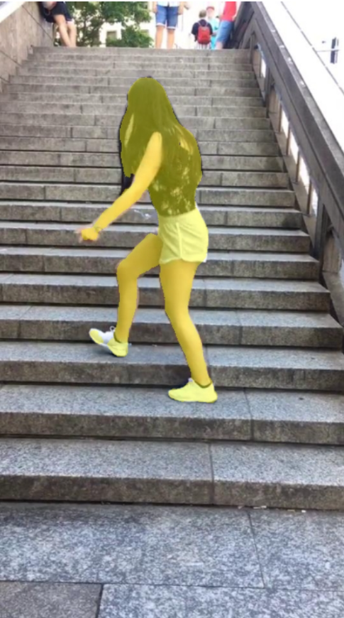

## TikTok segmentation 

### Overview
This documentation provides information about the TikTok segmentation project, including the data used, the methods and ideas employed, and the accuracy achieved. It also includes usage instructions and author information.


### Data
The dataset used for training and scoring is loaded with pytorch and consists images with dancing people.

[Link to the dataset on Kaggle](https://www.kaggle.com/datasets/tapakah68/segmentation-full-body-tiktok-dancing-dataset
)
## Model Architecture
The TikTok segmentation neural network model is built using the Unet architecture. The architecture of the model consists two parts -- encoder and decoder.
## Usage
### Requirements

- Python 3.10

### Getting Started
```bash
git clone https://github.com/SoulHb/TikTok.git
```
Clone repository
```bash
cd TikTok
```
move to project folder
```bash
pip install -r requirements.txt
```
Install dependencies
### Training
The model is trained on the provided dataset using the following configuration:
- Optimizer: Adam
- Learning rate: 0.001
- Loss function: BCEWithLogitsLoss
- Batch size: 8
- Number of epochs: 10

```bash
python train.py --saved_model_path your_model_path --epochs 10 --lr 0.001 --batch_size 32 /path/to/result /path/to/masks
```
Run train.py

## Inference
To use the trained model for TikTok segmentation, follow the instructions below:

### Without docker:

```bash
cd src
```
Move to src folder
```bash
python inference.py --saved_model_path /path/to/your/saved/model
```
Run Flask api

```bash
streamlit run /home/solution/Downloads/project/TikTok/src/ui.py
```
Run streamlit ui
### With docker:

```bash
cd src
```
Move to src folder
 ```bash
docker-compose -f ./docker_compose.yml up
```
Run docker-compose

## IOU
After training, the model achieved an IOU of 90% on the validation set.

### Example input/output image:
    




### Example input/output video:


## Author
This TikTok segmentation project was developed by Namchuk Maksym. If you have any questions, please contact with me: namchuk.maksym@gmail.com
